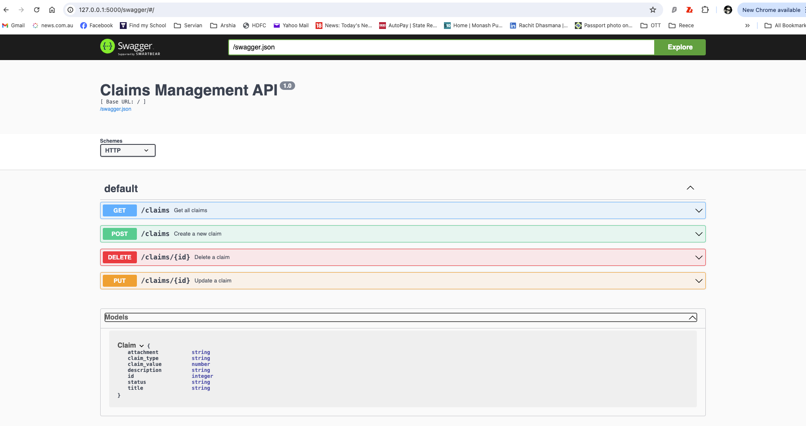

## Claims Management System

This project is a simple full-stack application for managing claims. It uses Python Flask as the backend and HTML/JavaScript for the frontend. The application supports creating, reading, updating, and deleting claims, with additional support for claim types, statuses, and file attachments.

### Table of Contents

1. [Features](#features)
2. [Prerequisites](#prerequisites)
3. [Installation](#installation)
4. [Running the Application](#running-the-application)
5. [Running with Docker](#running-with-docker)
6. [API Endpoints](#api-endpoints)
7. [Running Tests](#running-tests)
8. [Folder Structure](#folder-structure)
9. [Project Plan](#project-plan)
10. [Test Plan](#test-plan)

### Features

- Add, view, update, and delete claims.
- Role based access to resources (User, Admin)
- Claims have titles, descriptions, types, values, statuses, and attachments.
- Supports file uploads for attachments.
- Claims statuses can be changed and include: new, acknowledged, approved, and denied.

### Prerequisites

Ensure you have the following installed:

- Python 3.9+
- Flask
- Flask-SQLAlchemy
- Flask-Swagger-UI
- Flask-Bcrypt
- Flask-Jwt-Extended
- Werkzeug

### Installation

1. **Clone the repository**:
    ```sh
    git clone https://github.com/rachitdhasmana/claims-management-system.git
    cd claims-management-system
    ```

2. **Create a virtual environment and activate it**:
    ```sh
    python3 -m venv venv
    source venv/bin/activate  # On Windows use `venv\Scripts\activate`
    ```

3. **Install dependencies**:
    ```sh
    pip install -r requirements.txt
    ```

### Running the Application

1. **Run the Flask application**:
    ```sh
    flask run
    ```

2. Open your browser and navigate to `http://127.0.0.1:5000` to see the application.


### Running with Docker

1. Build the Docker image:
    ```sh
    docker build -t claims-management-system .
    ```

2. Run the Docker container:
    ```sh
    docker run -p 5050:5050 -p 8080:8080 claims-management-system
    ```
3. The docker image can also be downloaded from docker-hub:   
   - Docker-hub hosted image can be found [here](https://hub.docker.com/repository/docker/rachitdhasmana/claims-management-system/general)
   ```sh
    docker pull rachitdhasmana/claims-management-system:latest
    docker run -p 5050:5050 -p 8080:8080 rachitdhasmana/claims-management-system
    ```

4. Open your browser and navigate to `http://localhost:5050` to view the application.

   The uploaded files can be accessed via `http://localhost:8080`.


### API Endpoints

- **POST /register**
    - Register a new user.
    - Request: Form data including title, description, claim_type, claim_value, and optional attachment file.
    - Response: JSON message confirming registration of user.
- 
- **POST /login**
    - login with user credentials.
    - Request: JSON data with username and password.
    - Response: JSON message confirming login.

- **GET /api/claims**
    - Fetch all claims.
    - Response: JSON array of claims.
  
- **POST /api/claims**
    - Create a new claim.
    - Request: Form data including title, description, claim_type, claim_value, and optional attachment file.
    - Response: JSON object of the created claim.

- **PUT /api/claims/<id>**
    - Update an existing claim by ID.
    - Request: JSON object including title, description, claim_type, claim_value, and status.
    - Response: JSON object of the updated claim.

- **DELETE /api/claims/<id>**
    - Delete an existing claim by ID.
    - Response: JSON message confirming deletion.

### Detailed API Specs
- **Detailed API specs can be found [here](api_specs.md)**

### Running Tests

1. **Create a temporary file for testing purposes**:
    ```sh
    echo 'Test file content' > test_file.txt
    ```

2. **Run the tests**:
    ```sh
    python -m unittest test_app.py
    ```

3. **Clean up the temporary file**:
    ```sh
    rm test_file.txt
    ```

### Folder Structure

```
claims-management-system/
│
├── app.py               # Main Flask application
├── requirements.txt     # Python dependencies
├── Dockerfile           # Dockerfile to create Docker image
├── start.sh             # Script to start Flask app and HTTP server
├── test_app.py          # Unit tests
├── swagger.json         # API config spec for SwaggerUI
│
├── templates/
│   ├── register.html    # register user template
│   ├── login.html       # login user template
│   ├── add_claim.html   # add claim template
│   └── claims.html      # Claims listing template
│
├── static/
│   ├── register.js      # JavaScript for register page handling
│   ├── login.js         # JavaScript for login page handling
│   ├── add_claim.js     # JavaScript for add claim page handling
│   └── claims.js        # JavaScript for claims page handling
│
└── uploads/             # Folder for uploaded files
```

### Detailed Explanation

#### `app.py`

- **Models**: Defines the `User` model with fields for `username`, `password` and `role` and  `Claim` model with fields for `title`, `description`, `claim_type`, `claim_value`, `status`, and `attachment`.
- **Routes**:
  - `/register` and `/login`: Render the register and login pages.
  - `/add`: Render add claim page
  - `/api/claims`: API endpoints for managing claims.
  - Handles file uploads for claim attachments.
  - Handles JWT token based authentication.

#### `templates/register.html`

- Form for registering new user with field for username and password.

#### `templates/login.html`

- Form for logging in the new user with username and password.
- passes the response token to the claims template.

#### `templates/add_claim.html`

- Form for adding new claims with fields for title, description, type, value, and file upload.
- Links to the claims listing page.

#### `templates/claims.html`

- Displays all claims with options to update or delete each one.
- Includes fields for title, description, type, value, status, and attachment.
- Button to add new claim.
- Button to log out of current user session.

#### `static/register.js`

- Handles registration of new user, calls login template after successful registration.

#### `static/login.js`

- Handles loggin in user with username and password, pass on JWT token to claims template.

#### `static/add_claim.js`

- Handles adding new claims via the form on the add_claim template.

#### `static/claims.js`

- Fetches and displays claims.
- Handles updating and deleting claims.

#### `test_app.py`

- Unit tests for the application covering adding, retrieving, updating, and deleting claims.

### SwaggerUI

Swagger is a web-based API documentation framework. It is used to create interactive documents for APIs which are built to serve a specific purpose. Swagger UI documents enjoy many advantages when compared to other document types:

- It’s open-source
- Enable you to create and share API documentation
- Allows you to test APIs
- Access API spec through url: http://<base-url>:<port>/swagger (http://127.0.0.1:5000/swagger)




### Project Plan
Detailed project plan for the project can be found **[here](Project-plan.md)**

### Test Plan
Detailed Test plan for the project can be found **[here](test-plan.md)**

### Conclusion

This project provides a complete full-stack solution for managing claims with support for various claim types, statuses, and file attachments. The detailed instructions above should help you set up, run, and test the application efficiently. Feel free to contribute and improve the project by opening issues or pull requests on GitHub.